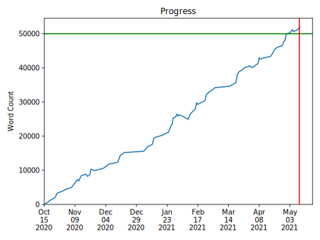

# Paper

A little tool for generating and managing academic papers. Focused on [Chicago Manual of Style citations](https://www.chicagomanualofstyle.org/tools_citationguide.html) and the [paper submission standards of the BC STM](https://libguides.bc.edu/academicpapers_stm/formatting_papers). It also handles metadata, tracking progress towards due-date/word-count targets, and a reasonable default filename based on metadata (`{LastName}_{ClassMnemonic}_{Assignment}.{extension}`).  I have no illusions that anyone besides me will want to use it directly, but there may be **something** of interest **somewhere** in here for **someone**. 

You can see styles of produced documents in the `output` directories of the various [`examples`](./examples/).

In general, it just does a simple [pandoc](https://pandoc.org/) assembly of whatever Markdown files are in the `content` directory, but it has some custom filters for my/STM needs.
* citation keys like `@Bible-NABRE` do appropriate in-text biblical citations with the given translation (only referencing it on the first usage unless there are multiple translations used within a single paper)
    * exception being the Vulgate, which gets a normal footnote citation on first usage and then mentioned on each subsequent
* if the author is listed as the USCCB, abbreviation is used on subsequent references
    * (I'm told that [CSL](https://citationstyles.org/) 1.1 will have author short names, but that's been "coming very soon" since early 2020...)
* Papal Encyclicals have strange citation standards, but in concert with a very carefully prepared citation library, this will ensure that the capitalization of the Latin names is consistent
* section symbols (§) are used instead of "sec.", unless the the cited item is a newspaper article.
* The _Summa Theologica_ drops the author on subsequent citations

## Installation
Assuming you have a working [Python](https://www.python.org) installation and know what `pip` means...

Clone this repository, and then, while inside of it: 

```shell
pip install -e .
```

(If I ever release this publicly it'll be a slightly simpler process.)

## Commands
* `paper new`: generates a new scaffold directory
* `paper init`: sets up the directory you're in as the scaffold, so long as it's empty
* `paper build`: builds an output version of the paper for submission
    - you can pass `--output-format` with any of the following values. The PDF versions will overwrite each other.
        - `docx` _(default)_: a Word document
        - `docx+pdf`: a Word document and a PDF generated from it
        - `latex`: a LaTeX file
        - `latex+pdf`: a LaTeX file and a PDF generated from it
        - `json`: really just for debugging Lua filters, but hey, go for it
    - there is also a `--docx-revision` option that you can pass an integer to set the revision number in the metadata visible in Word (with a normally produced file, this is the number of times you saved it); if not set or <= 0, will use the number of git commits
* `paper wc`: outputs word count information, broken down by file
* `paper save`: modifies the metrics in the readme (word count, progress towards goal) and makes a git commit, prompting for a message and appending some extra data to it
    - can pass a message directly with `--message`, just like with a regular git commit
* `paper fmt`: runs an automated formatter over all the Markdown files in the `content` directory (under the hood, just uses pandoc "translating" from Markdown to Markdown)
    - `--wrap`/`--no-wrap`: whether to wrap the file to a certain width (default: `--wrap`)
    - `--columns`: giving an integer value here, how many characters to allow in a line before wrapping (default: `80`)
* `paper push`: if you've already set up an upstream repository, pushes to it. if not, will make a GitHub repo, prompting for a name (recommended template based on metadata), private v public, etc. 
* `paper web`: assuming you've pushed to a GitHub repo at least once, this will open the web page for said repo

## `paper_meta.yml`
The metadata file that assists in the generation. YAML format. `paper` will walk up the directory tree until the root looking for similarly named files, so you can have a root `paper_meta.yml` with the author name, one in a directory for each class with the professor and mnemonic, etc. (Note this is only traversed when the project is set up; it doesn't automatically pick up changes live, but writes the full coalesced data to the lowest file in the hierarchy at init time.)

* `data`: 
    * (These are variables that will be put into the actual text of the paper itself, usually on the title page. It also gets used by `paper` for default filenames and things. )
    * `date`: due date in ISO-8601 format OR `null` OR placeholder `"[DATE]"` (if set, will be graphed as a red line on the progress image)
    * `author`: author's name
    * `title`: title of paper
    * `class_mnemonic`: like "PHIL 101" or whatever
    * `class_name`: like "Introduction to Philosophy" or whatever
    * `professor`: the person what teaches the class
* `target_word_count`: if not null, will be graphed as a green line on the progress image
* `sources`: An array of paths to BibTeX (`.bib`) or CSL JSON files that contain citation data exported from Zotero, for example. If present and non-empty, [`pandoc` will be given these files in an effort to process citations](https://pandoc.org/MANUAL.html#citations).
* `vulgate_cite_key`: if citing a Bible with the translation listed as `"Vulgatam"`, you need to specify a citation key for the initial footnote. If you're not dealing with the Vulgate, you don't need to worry about this! 
* `base_font_override`: change away from the default Times New Roman. Doesn't do any checking to make sure it's a valid font name, or that it doesn't destroy your layout, crash Word, erase your hard drive, etc. You're on your own if you go playing here...
* `mono_font_override`: same as above, but for the monospace font (which is Consolas by default)

### output-specific variables
These variables are only relevant to their given output formats. 
* `latex`:
    * `fragment`: if set to `true`, only produce the content file, if you have another template ready to use. 
    * `ragged`: if set to `true`, don't justify the text, but leave it with a ragged-right edge

## `./content` folder
Any file in this folder that ends with `.md` will be given to pandoc for assembly into the final paper. Note that they're given in alphabetical order, and should be Markdown files. At the moment, no metadata in them is processed. 

## Metrics
On top of doing the document generation, assuming you use `paper save` to commit your work, it also generates progress reports like the below, based on git commits. (This example shows good consistent progress towards a ~50,000 word thesis. The green line is target word count; the red line is the due date.)

<!-- begin paper metadata -->
### Example progress metrics
| File                      | Word Count |
| ------------------------- | ----------:|
| `00_intro.md`             |       2838 |
| `01_initial_problem.md`   |       9782 |
| `02_literature_review.md` |       6465 |
| `03_experiment_design.md` |      18254 |
| `04_analysis.md`          |      10075 |
| `05_next_steps.md`        |       2483 |
| `06_conclusion.md`        |       2162 |
| **TOTAL**                 |      52059 |


<!-- end paper metadata -->

## Notes
`paper` assumes: 
* you have [pandoc](https://pandoc.org/) installed
* you have git set up
* you have [gh](https://cli.github.com/) installed and are logged in to a GitHub account
    - only needed for initial push; if you don't like GitHub you can manually push and then everything will just work normally from there
    - also used for the `web` command
* If using the docx builder:
    * you have Microsoft Word installed
    * you are running on a Mac (uses AppleScript to turn docx to pdf)
* If using the LaTeX builder:
    * you have [the Tempora fonts](https://www.ctan.org/pkg/tempora) installed on your system, not just in TeX 
    * you have a TeX distribution installed and can install packages for it as errors crop up
    * the builder needs at least: `turabian-formatting`, `footmisc`, `xstring`, `etoolbox`, `setspace`, `nowidow`, `endnotes`, `xurl`, and `href-ul`
        - probably some others, too ¯\\\_(ツ)\_/¯	
* you are not doing any zany branching stuff with your repo
    - should still work, but who knows? I tend to not branch on non-collaborative projects, so not a use case I've looked at a ton
* you are not malicious; input is not sanitized or anything
* you are not afraid of error messages; it happily crashes on exceptions

